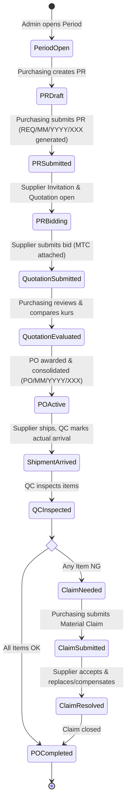
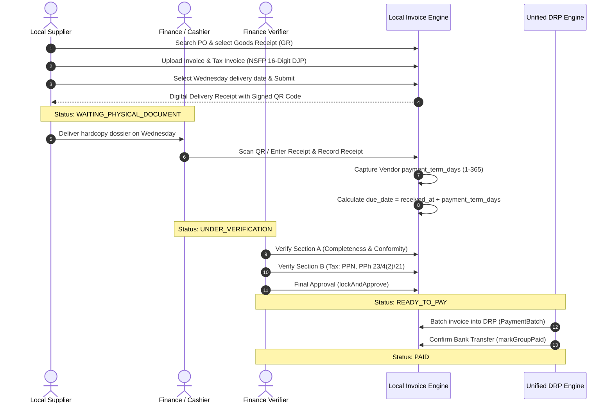
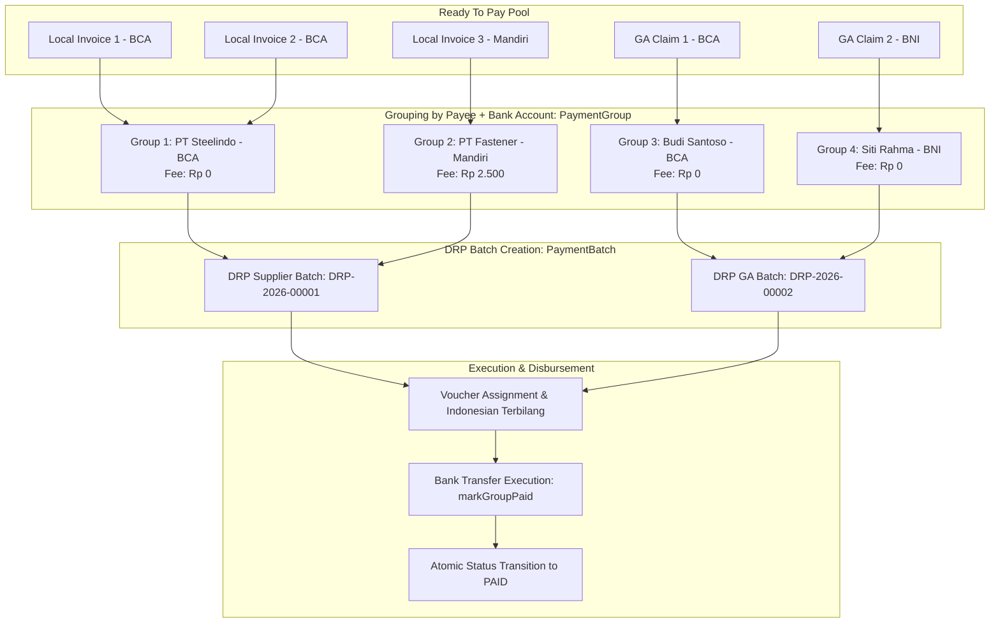
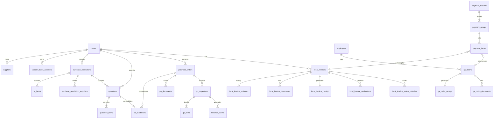

# ADASI Portal Supplier — Comprehensive System Architecture & Engineering Context

> **Version:** 2.0 (Post Local Supplier & Unified Payment Engine Remediation)  
> **Target Enterprise:** PT. Astra Daido Steel Indonesia (ADASI)  
> **System Scope:** Dual-Core Enterprise Procurement & Payment Automation (Import Material Procurement + Local Vendor & GA Unified Payment Engine)  
> **Canonical Location:** `context.md` (Repository Root)

---

## 1. Executive Summary & Dual-Core System Architecture

**ADASI Portal Supplier** is an enterprise-grade procurement, quality control, vendor management, and financial disbursement platform developed for **PT. Astra Daido Steel Indonesia (ADASI)**. The platform digitalizes and unifies two major operational pipelines:

```
                                  ADASI PORTAL SUPPLIER
                                            │
        ┌───────────────────────────────────┴───────────────────────────────────┐
        ▼                                                                       ▼
┌──────────────────────────────────────┐            ┌──────────────────────────────────────┐
│       CORE 1: IMPORT PROCUREMENT     │            │    CORE 2: LOCAL SUPPLIER & DRP      │
├──────────────────────────────────────┤            ├──────────────────────────────────────┤
│ • Annual & Monthly Planning Periods  │            │ • Local Vendor Master & Bank Profiles│
│ • Purchase Requisitions (PR)         │            │ • Digital PO & Goods Receipt (GR)    │
│ • Material Master & Auto HS Code     │            │ • Invoice Submission & QR Receipts   │
│ • Supplier Invitation & Quotations   │            │ • Wednesday Physical Reception       │
│ • Real-time & Snapshot Kurs Engines  │            │ • 2-Section Gated Tax Verification   │
│ • Multi-Quotation PO Consolidation   │            │ • NSFP (16-Digit DJP Tax Invoices)   │
│ • International Shipment Tracking    │            │ • General Affairs (GA) Reimbursement │
│ • QC Inspection (OK / NG Criteria)   │            │ • Unified DRP Batch Payment Engine   │
│ • Material Claims & Root Cause Res.  │            │ • Cashflow Forecasting (4Wk / 6Mo)   │
└──────────────────────────────────────┘            └──────────────────────────────────────┘
```

---

## 2. Technology Stack & Technical Specifications

| Layer | Technologies & Libraries | Technical Specifications & Invariants |
|---|---|---|
| **Backend Runtime** | PHP 8.2.x + Laravel 12 (MVC) | Strict typing, FormRequest boundaries, Transaction-locked services. |
| **Frontend Architecture** | Blade Templates + Bootstrap 5 compatibility + Tailwind CSS (`tw-` prefix) | Tailwind `preflight: false`. CDN-loaded Bootstrap 5, DataTables, SweetAlert2, Chart.js. Vite compiles `resources/css/app.css` and `resources/js/app.js`. |
| **Database & ORM** | MySQL 8.0 (InnoDB) + Eloquent ORM | Strict foreign keys, decimal precision (`decimal:2` / `decimal:4`), polymorphic relations, soft deletes for legal records. |
| **Interactivity & State** | Alpine.js, jQuery, DataTables Server-Side (`yajra/laravel-datatables`) | High-volume tables use server-side pagination, sorting, and search endpoints. |
| **Realtime & Messaging** | Pusher Channels + Laravel Echo | WebSockets for instant notifications and unread counters; 30-second polling fallback. |
| **Security & Authentication**| Laravel Auth + Middleware RBAC + 2FA (`google2fa`) + Cloudflare Turnstile | Session-based auth, brute-force throttling, rate-limited resubmission endpoints. |
| **URL Security** | Hashids (`vinkla/hashids`) via `HasHashids` trait | Primary database integer IDs are obfuscated on external URLs. |
| **Storage & Attachments** | Laravel Storage (Private Disk) | Encrypted/protected storage (`storage/app/private/`). Zero direct public access. Polymorphic `attachments` table. |
| **Reporting & Exports** | Laravel Excel (Maatwebsite) + Queue Engine | Operational exports execute asynchronously via background queue workers (`ProcessExportJob`). Direct download for templates. |

---

## 3. User Roles, Permissions & Data Governance (RBAC)

Every route, controller action, and database query strictly adheres to Role-Based Access Control (RBAC):

```mermaid
graph TD
    Admin[Role: admin<br/>Full Master Governance & Audit] --> AllModules[All Modules & System Config]
    
    Purchasing[Role: purchasing<br/>Procurement & Vendor Vetting] --> PR[Purchase Requisitions]
    Purchasing --> Eval[Quotation Evaluation & Bidding]
    Purchasing --> PO[PO Creation & Award]
    Purchasing --> Claims[Material Claims Review]
    Purchasing --> VendorVetting[Vendor Profile Stage 1 Vetting]
    
    SupplierImport[Role: supplier (Scope: import)<br/>International Bidding] --> Bidding[Bidding & Quotations]
    SupplierImport --> Shipments[Shipment Dispatch]
    SupplierImport --> ClaimResp[Material Claim Responses]
    
    SupplierLocal[Role: supplier (Scope: local)<br/>Domestic Fulfillment] --> LocalInv[Invoice Submission & NSFP]
    SupplierLocal --> LocalReceipt[Digital Delivery Receipts]
    SupplierLocal --> VendorProfile[Profile & Bank Change Requests]
    
    QC[Role: qc<br/>Quality Control] --> Inspection[Material Inspections OK/NG]
    QC --> ActualArrival[PO Actual Arrival Tracking]
    
    Finance[Role: finance<br/>Cashier & Disbursement] --> Cashier[Physical Document Reception]
    Finance --> Verify[2-Section Tax Verification]
    Finance --> DRP[Unified DRP Batch Creation]
    Finance --> Payment[Bank Transfer Execution & Vouchers]
    Finance --> Forecast[Weekly & Monthly Cashflow Forecast]
    Finance --> BankApproval[Vendor Bank Account Verification]
    
    GA[Role: ga<br/>General Affairs] --> Employees[Employee Master]
    GA --> GaClaims[Operational Claim Submission]
    GA --> GaDRP[GA DRP Draft Generation]
```

### Critical Security Invariant: Supplier Data Isolation
1. **Owner Foreign Key Semantics:** The `supplier_id` column across `quotations`, `purchase_orders`, `material_claims`, `local_invoices`, and `purchase_requisition_suppliers` is a foreign key referencing **`users.id`**, **never** `suppliers.id`.
2. **Scope Constraint:** Supplier-facing queries must always be constrained by:
   ```php
   ->where('supplier_id', auth()->id())
   ```
3. **Partitioning by Supplier Scope:** The `supplier_scopes` table restricts vendors to either `import` or `local` operations via middleware `supplier.scope:local` or `supplier.scope:import`.

---

## 4. Domain 1: Import Material Procurement (Specialty Steel)

The import material procurement module manages international procurement of specialty steel from invited global manufacturers:



### Core Business Rules & Invariants (Import):
1. **Atomic Sequence Generation:**
   - PR Number: `REQ/MM/YYYY/XXX` (e.g., `REQ/05/2026/001`)
   - PO Number: `PO/MM/YYYY/XXX` (e.g., `PO/05/2026/001`)
   - Generated via atomic database row locking (`lockForUpdate()`) on `document_sequences`.
2. **Material Weight & HS Code Engine:**
   - Automated weight calculations depend on material geometry (Round, Flat, Hollow).
   - HS Code automated inference resolves duty rules based on chemical classification and dimensions.
3. **Quotation Pricing Formula:**
   - The application strictly calculates item total amounts server-side:
     $$\text{Amount} = \text{round}(\text{price\_per\_kg} \times (\text{weight\_needed} \times \text{quantity\_value}), 4)$$
   - Supplier client input for `amount` is never trusted.
4. **Exchange Rate (Kurs) Snapshot Architecture:**
   - Supported currencies: `USD`, `JPY`, `CNY`, `IDR`.
   - Quotation submission takes a snapshot of `ExchangeRate::latestRate($currency)` and stores `exchange_rate_id`.
   - PO creation takes a new snapshot of the rate valid on that day.
   - Price comparison modules join against the historical snapshot (`LEFT JOIN exchange_rates ON exchange_rate_id`), never against live rates, ensuring audited historical figures remain immutable.
5. **PO Consolidation Pivot:**
   - One PO can consolidate multiple accepted quotations from the same supplier via `po_quotations` pivot (`PurchaseOrder::quotations()`).
6. **Mandatory Tracking Timestamps:**
   - `purchase_requisitions.created_at` (PR creation date)
   - `purchase_orders.created_at` (PO issue date)
   - `purchase_orders.estimated_arrival` (Purchasing target arrival)
   - `purchase_orders.actual_arrival` (QC verified warehouse arrival)

---

## 5. Domain 2: Local Supplier Ecosystem & Invoice Lifecycle (V2)

The Local Supplier V2 ecosystem digitizes domestic procurement (goods & services), enforcing strict tax compliance, physical document tracking, and staged verification:



### Detailed Lifecycle Stages & Rules:

#### 1. PO Reference & Goods Receipt (GR)
- Local suppliers search available POs via `LocalPoReferenceService` (backed by `DatabaseLocalPoProvider`).
- Manual PO fallback requires explicit Goods Receipt numbers; synthetic fallbacks (`GR-PO...`) are strictly prohibited.

#### 2. Digital Submission & NSFP (Nomor Seri Faktur Pajak)
- **Validation:** PKP (Pengusaha Kena Pajak) suppliers must supply a valid 16-digit DJP Tax Invoice number.
- **Masking:** Stored and rendered in canonical Indonesian format: `XX.XXX-XX.XXXXXXXX` (e.g., `010.000-26.12345678`).
- **Resubmission Redirection:** Submission immediately redirects to `local-supplier.invoices.receipt` providing a QR-signed printable receipt.

#### 3. Wednesday Physical Delivery Scheduling & Expiry
- Physical document delivery to the ADASI cashier is restricted to **Wednesdays** (`scheduled_physical_delivery_date`).
- If a vendor misses scheduled delivery twice (`missed_delivery_count >= 2`), the submission automatically transitions to `EXPIRED`.

#### 4. Cashier Reception & Due Date Initiation
- Physical receipt timestamp (`cashier_received_at`) is the authoritative trigger that starts the payment term clock.
- Due date is dynamically calculated from the vendor's active master profile:
  $$\text{due\_date} = \text{cashier\_received\_at} + \text{payment\_term\_days\_snapshot}$$
- Rejection occurs if the vendor profile lacks a valid payment term (1–365 days).

#### 5. Two-Section Gated Verification
- **Section A (Completeness & Reference Checks):**
  - Checkpoints: `invoice`, `tax_invoice`, `po`, `delivery_note` (Surat Jalan), `gr`.
  - Surat Jalan cannot be marked NOT APPLICABLE for Goods (`Barang`) suppliers.
  - Tax invoice cannot be marked NOT APPLICABLE for PKP suppliers.
- **Section B (Tax & Accounting Verification):**
  - PPN validation: Sesuai vs Tidak Sesuai (requires corrected PPN and audit notes).
  - Withholding tax applicability: PPh 23, PPh 4(2), PPh 21 with base, rate, and amount snapshots.
  - **Net Payable Formula:**
    $$\text{Net Payable} = \text{DPP} + \text{PPN}_{\text{verified}} - (\text{PPh}_{23} + \text{PPh}_{4(2)} + \text{PPh}_{21})$$
- **Atomic Gating:** `lockAndApprove()` locks the verification record (`is_locked = true`), transitions status to `READY_TO_PAY`, and dispatches notification.

#### 6. Revision & Resubmission Invariants
- When Finance requests revision, status transitions to `NEED_REVISION`.
- Resubmission by supplier resets cashier receipt, review dates, and due date to `NULL`, requiring fresh physical receipt.
- Status history records exact source state (`from_status: UNDER_VERIFICATION`) and notes.

---

## 6. Domain 3: General Affairs (GA) Operational Reimbursement

The General Affairs module provides internal employee expense claim management, integrating directly into the disbursement engine:

1. **Employee Master Data:** Centralized record of employee name, department, and verified bank account (`Employee` model).
2. **Claim Types:** Medical, Operational, Travel, Entertainment, Office Supplies.
3. **Claim Workflow:**
   $$\text{DRAFT} \longrightarrow \text{SUBMITTED} \longrightarrow \text{UNDER\_REVIEW} \longrightarrow \text{READY\_TO\_PAY} \longrightarrow \text{PAID}$$
4. **Digital QR Verification:** GA claims generate printable receipts with signed QR codes (`/verify-receipt/ga/{receipt}`).
5. **Zero Bank Fee Invariant:** Unlike commercial vendors, GA employee reimbursement transfers **never incur bank transfer fees** ($\text{Bank Fee} = \text{Rp } 0$).

---

## 7. Domain 4: Unified Payment Engine (DRP - Daftar Rencana Pembayaran)

The Unified Payment Engine consolidates eligible payables (`LocalInvoice` and `GaClaim`) into structured payment batches for treasury execution:



### Core Invariants & Calculations (Payment Engine):

#### 1. Batch Numbering
- Sequence: `DRP-YYYY-XXXXX` (e.g., `DRP-2026-00001`).
- Typed: `SUPPLIER` (vendor invoices) or `GA` (internal employee claims).

#### 2. Payee Grouping & Bank Fee Rules
- Invoices/claims are grouped by `payee_id` and verified `account_number`.
- **Bank Fee Snapshot Rules:**
  - `PaymentGroup::isBca()` = `true` $\longrightarrow \text{Bank Fee} = \text{Rp } 0$
  - `PaymentGroup::isBca()` = `false` (Non-BCA Supplier) $\longrightarrow \text{Bank Fee} = \text{Rp } 2.500$
  - GA Reimbursements $\longrightarrow \text{Bank Fee} = \text{Rp } 0$ (all banks)
  - Manual fee override requires a mandatory audit rationale (`fee_override_reason`).

#### 3. Item Removal & Dynamic Batch Recalculation
- While in `DRAFT` status, Finance can remove items.
- If all items in a group are removed, the group automatically transitions to `STATUS_CANCELLED`.
- Cancelled groups are excluded from batch totals and unpaid counts (`whereNotIn('status', [STATUS_PAID, STATUS_CANCELLED])`).

#### 4. Finalization Guardrails (`finalizeBatch`)
- Requires at least one active item.
- Re-validates that every item's underlying payable is still in `READY_TO_PAY` status before locking.

#### 5. Payment Voucher & Indonesian Terbilang
- `PaymentVoucherService` assigns voucher number and date.
- Formats Indonesian currency words recursively up to trillions (e.g., `Rp 11.997.500` $\longrightarrow$ *"Sebelas Juta Sembilan Ratus Sembilan Puluh Tujuh Ribu Lima Ratus Rupiah"*).

#### 6. Atomic Payment Confirmation (`PaymentExecutionService`)
- Recording payment (`markGroupPaid`) requires `transfer_reference` and `transfer_date`.
- Atomically marks the group as `PAID`.
- Atomically updates all associated invoices/claims to `PAID` with completed timestamps and audit histories.
- Automatically recalculates batch status:
  - If all active groups are paid $\longrightarrow \text{Batch Status: } \mathbf{PAID}$
  - If any active group remains unpaid $\longrightarrow \text{Batch Status: } \mathbf{PARTIALLY\_PAID}$

#### 7. Cashflow Forecasting Engine (`PaymentForecastService`)
- Provides 4-Week (Weekly) and 6-Month (Monthly) forward cashflow projections.
- **Anti-Double Counting Precedence:**
  1. Active DRP items use the planned `transfer_date` (or group `created_at`).
  2. Unbatched `READY_TO_PAY` invoices use their authoritative `due_date`.
  3. Unbatched `READY_TO_PAY` GA claims use `ready_to_pay_at` or `claim_date`.
  4. Invoices under review or verification are strictly excluded from cash forecasts.

---

## 8. Database Entity Relationship Overview



### Table Definitions & Storage Schema:

| Table Name | Primary Purpose & Key Columns | Special Constraints & Indexes |
|---|---|---|
| `users` | User credentials, roles (`admin`, `purchasing`, `supplier`, `qc`, `finance`, `ga`), 2FA. | Unique email, soft deletes. |
| `supplier_scopes` | Maps `supplier_id` (users.id) to `scope` (`import` or `local`). | Unique `[supplier_id, scope]`. |
| `suppliers` | Company profile, address, category, `vendor_category`, `is_pkp`, `payment_term_days`. | Keyed by `user_id`. |
| `supplier_bank_accounts` | Vendor banking profiles: `bank_name`, `account_number`, `account_holder_name`, `status`. | Status: `PENDING`, `VERIFIED`, `REJECTED`, `INACTIVE`. |
| `purchase_requisitions` | Import demand headers: `pr_number`, `period_id`, `status`. | Status: `draft`, `submitted`, `rejected`, `bidding`, `completed`. |
| `pr_items` | Material specs: dimensions, geometry, weight, HS code metadata. | Polymorphic links, soft deletes. |
| `quotations` | Bids from import suppliers: `price_per_kg`, `exchange_rate_id`, currency, validity. | Status: `draft`, `submitted`, `accepted`, `rejected`. |
| `purchase_orders` | Import purchase orders: `po_number`, `currency`, `estimated_arrival`, `actual_arrival`. | Status: `active`, `waiting_qc`, `claim_needed`, `completed`. |
| `po_quotations` | Pivot table consolidating multiple quotations into one PO. | Unique `[po_id, quotation_id]`. |
| `qc_inspections` | Receiving QC result: `status` (`ok`, `ng`), inspection date, inspector ID. | Soft deletes. |
| `material_claims` | Discrepancy claims for NG materials: description, expected resolution, responses. | Soft deletes. |
| `local_invoices` | Domestic vendor invoices: `invoice_number`, `tax_invoice_number` (NSFP), amounts, `due_date`. | Status: `WAITING_PHYSICAL_DOCUMENT`, `UNDER_VERIFICATION`, etc. |
| `local_invoice_verifications`| 2-Section verification data: checks, PPN conformity, PPh withholding tax snapshots. | Unique `[local_invoice_id, revision_number]`. |
| `employees` | Internal General Affairs employees: name, department, bank account details. | Active scope. |
| `ga_claims` | Operational employee reimbursement claims: `claim_number`, claim type, amount. | Status: `DRAFT`, `READY_TO_PAY`, `PAID`, etc. |
| `payment_batches` | DRP Batch header: `batch_number`, `batch_type` (`SUPPLIER`/`GA`), totals, status. | Status: `DRAFT`, `FINALIZED`, `PARTIALLY_PAID`, `PAID`. |
| `payment_groups` | Payee & bank account cluster: subtotal, bank fee, net amount, voucher details. | Status: `UNPAID`, `PAID`, `CANCELLED`. |
| `payment_items` | Polymorphic payable links: `payable_type`, `payable_id`, `amount`, `status` (`ACTIVE`/`REMOVED`). | Indexed polymorphic relationship. |
| `attachments` | Polymorphic file store: `attachable_type`, `attachable_id`, `file_path`, mime type. | Private storage disk. |

---

## 9. API & Route Catalog

### 1. Public & Verification Routes
- `GET /` $\longrightarrow$ Redirect to `/login`
- `GET /verify-receipt/supplier/{receipt}` $\longrightarrow$ Digital receipt authenticity check (Local Supplier)
- `GET /verify-receipt/ga/{receipt}` $\longrightarrow$ Digital receipt authenticity check (GA Employee)

### 2. Finance & Cashier Subsystem (`prefix: finance`, `role: finance,admin`)
- `GET /finance/dashboard` $\longrightarrow$ Finance dashboard & pending DRP summaries
- `GET /finance/forecast` $\longrightarrow$ 4-Week & 6-Month cashflow forecast
- `GET /finance/invoices` $\longrightarrow$ Local invoice verification register
- `GET /finance/invoices/{invoice}` $\longrightarrow$ Invoice review, document viewer & verification forms
- `POST /finance/invoices/{invoice}/receive-physical` $\longrightarrow$ Cashier hardcopy receipt (starts term clock)
- `POST /finance/invoices/{invoice}/verify-section-a` $\longrightarrow$ Section A verification (checklist)
- `POST /finance/invoices/{invoice}/verify-section-b` $\longrightarrow$ Section B tax verification (PPN/PPh)
- `POST /finance/invoices/{invoice}/approve-ready-to-pay` $\longrightarrow$ Lock verification & transition to `READY_TO_PAY`
- `POST /finance/invoices/{invoice}/request-revision` $\longrightarrow$ Request invoice revision from supplier
- `GET /finance/drp-supplier` $\longrightarrow$ Supplier DRP batch register & Ready to Pay candidates
- `POST /finance/drp-supplier` $\longrightarrow$ Create new Supplier DRP batch
- `GET /finance/drp-ga` $\longrightarrow$ GA DRP batch register
- `GET /finance/drp/{batch}` $\longrightarrow$ DRP batch detail, groups, items, and voucher tools
- `POST /finance/drp/{batch}/finalize` $\longrightarrow$ Finalize & lock DRP batch
- `POST /finance/drp-items/{item}/remove` $\longrightarrow$ Remove item from draft DRP (auto-cancels empty groups)
- `POST /finance/drp-groups/{group}/fee-override` $\longrightarrow$ Override bank transfer fee with mandatory reason
- `POST /finance/drp-groups/{group}/voucher` $\longrightarrow$ Assign bank voucher number and date
- `POST /finance/drp-groups/{group}/pay` $\longrightarrow$ Record payment execution (marks payables `PAID`)
- `GET /finance/master-invoices` $\longrightarrow$ Enterprise invoice master query repository
- `GET /finance/master-invoices/export` $\longrightarrow$ Queued Excel export of invoice records
- `GET /finance/vendor-master` $\longrightarrow$ Local vendor master list
- `POST /finance/vendor-change-requests/{request}/approve` $\longrightarrow$ Approve sensitive vendor profile change

### 3. Local Supplier Subsystem (`prefix: local-supplier`, `role: supplier`, `scope: local`)
- `GET /local-supplier/dashboard` $\longrightarrow$ Local supplier dashboard, invoice statuses & statistics
- `GET /local-supplier/invoices` $\longrightarrow$ Vendor invoice history
- `GET /local-supplier/purchase-orders/search` $\longrightarrow$ Auto-search active POs and eligible Goods Receipts
- `GET /local-supplier/invoices/create` $\longrightarrow$ New invoice submission form (with NSFP & Wednesday picker)
- `POST /local-supplier/invoices` $\longrightarrow$ Submit invoice (rate limited: 30/min)
- `GET /local-supplier/invoices/{invoice}` $\longrightarrow$ View invoice details, timeline, and review notes
- `GET /local-supplier/invoices/{invoice}/revision` $\longrightarrow$ Correct and resubmit revised invoice
- `POST /local-supplier/invoices/{invoice}/resubmit` $\longrightarrow$ Resubmit invoice
- `GET /local-supplier/invoices/{invoice}/receipt` $\longrightarrow$ View/print digital delivery receipt with QR code
- `GET /local-supplier/vendor-profile` $\longrightarrow$ View active company profile, tax status, and bank accounts
- `POST /local-supplier/vendor-profile/change-requests` $\longrightarrow$ Request vendor profile or bank changes
- `POST /local-supplier/vendor-profile/documents` $\longrightarrow$ Upload vendor master documents (NPWP, NIB, SPPKP)

### 4. General Affairs Subsystem (`prefix: ga`, `role: ga,admin`)
- `GET /ga/dashboard` $\longrightarrow$ GA operations dashboard
- `GET /ga/claims` $\longrightarrow$ Employee claims register
- `GET /ga/claims/create` $\longrightarrow$ File new employee claim
- `POST /ga/claims` $\longrightarrow$ Store employee claim
- `GET /ga/claims/{claim}` $\longrightarrow$ Claim details & receipts
- `GET /ga/claims/{claim}/receipt` $\longrightarrow$ View/print GA claim receipt with signed QR code
- `GET /ga/drp-draft` $\longrightarrow$ Prepare DRP GA Draft batch
- `POST /ga/drp-draft` $\longrightarrow$ Submit DRP GA Draft to Finance
- `RESOURCE /ga/employees` $\longrightarrow$ Employee Master CRUD

### 5. Import Purchasing Subsystem (`prefix: purchasing`, `role: purchasing`)
- `GET /purchasing/dashboard` $\longrightarrow$ Purchasing dashboard & procurement tracking
- `RESOURCE /purchasing/requisitions` $\longrightarrow$ Manage Purchase Requisitions (PR)
- `RESOURCE /purchasing/purchase-orders` $\longrightarrow$ Issue & manage Import POs
- `GET /purchasing/comparison/inter-supplier` $\longrightarrow$ Side-by-side supplier quotation comparison
- `GET /purchasing/comparison/historical` $\longrightarrow$ Historical material price trend analysis
- `GET /purchasing/comparison/vs-best` $\longrightarrow$ Price comparison vs historical minimum
- `RESOURCE /purchasing/claims` $\longrightarrow$ Material quality claim management

### 6. Quality Control Subsystem (`prefix: qc`, `role: qc`)
- `GET /qc/dashboard` $\longrightarrow$ QC inspection dashboard
- `RESOURCE /qc/inspections` $\longrightarrow$ Conduct and log material receiving inspections (OK/NG)

---

## 10. Engineering Invariants & Developer Guidelines

Before proposing or implementing any changes in this repository, software engineers and AI coding agents must adhere to the following strict invariants:

1. **Evidence-First Inspection:**
   Never assume database columns, routes, or model behaviors. Always inspect migrations, FormRequests, and model definitions before altering queries.
2. **Minimal Necessary Change:**
   Preserve existing behavior and interfaces unless an explicit requirement demands modification. Avoid speculative refactoring.
3. **Database Concurrency & Race Conditions:**
   Financial disbursements, document numbering, and state transitions must execute within explicit database transactions (`DB::transaction`) utilizing pessimistic locking (`lockForUpdate()`).
4. **Authoritative Server Calculations:**
   Financial amounts (`amount`, `total_weight`, `tax_amount`, `bank_fee`, `net_payable`) must be calculated by authoritative backend model helpers or services. Never trust client-submitted calculations.
5. **Polymorphic Storage Discipline:**
   File uploads must utilize the polymorphic `attachments` table and the `private` storage disk. Direct storage in `public/` is strictly forbidden.
6. **No Native Date Pickers in Blade:**
   Use the custom UI components `<x-ui.date-picker>` or `<x-ui.date-range-picker>`. Native `<input type="date">` is strictly prohibited to preserve cross-platform styling consistency.
7. **Test-Driven Verification:**
   Run relevant automated feature test suites whenever modifying business logic:
   ```bash
   php artisan test --filter=UnifiedPaymentEngineTest
   php artisan test --filter=SupplierDataIsolationTest
   php artisan test --filter=LocalInvoiceTest
   ```
