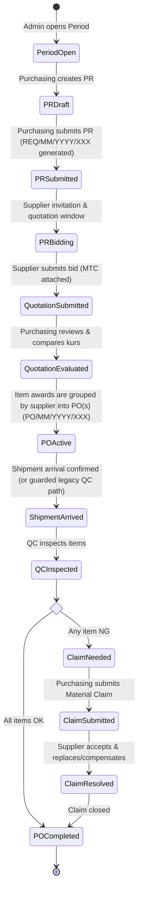
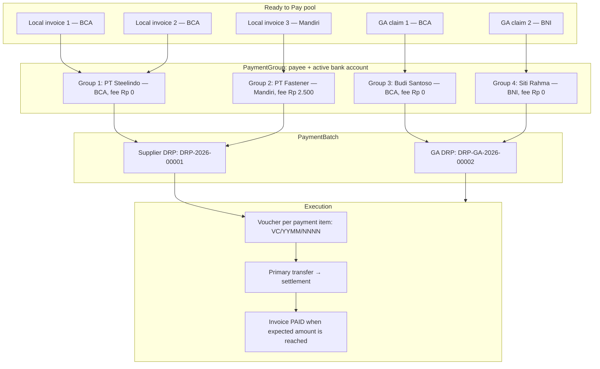
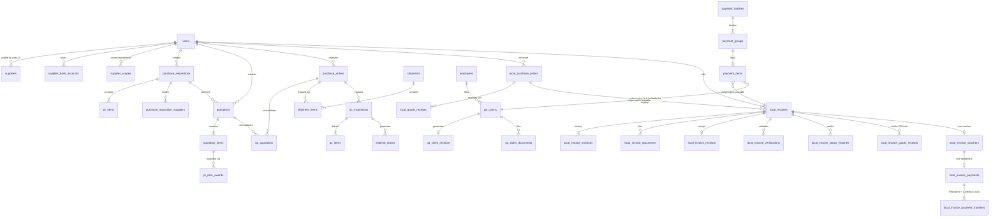

# ADASI Portal Supplier — Comprehensive System Architecture & Engineering Context

> **Version:** 2.1 (reconciled against code, migrations, and routes on 2026-10-08)  
> **Target Enterprise:** PT. Astra Daido Steel Indonesia (ADASI)  
> **System Scope:** Dual-Core Enterprise Procurement & Payment Automation (Import Material Procurement + Local Supplier & Unified Payment Engine)  
> **Canonical Location:** `context.md` (Repository Root)  
> **Coverage:** migrations through `2026_10_07_000003`. A migration file does not prove it has run on a database; check `php artisan migrate:status`.

**Precedence:** [AGENTS.md](AGENTS.md) is the primary project contract. Code, migrations, and tests win over every document. Where this file and the code disagree, the code is correct and the mismatch is listed in [§11](#11-reconciliation-log-and-open-discrepancies).

---

## 1. Executive Summary & Dual-Core System Architecture

**ADASI Portal Supplier** is an enterprise-grade procurement, quality control, vendor management, and financial disbursement platform developed for **PT. Astra Daido Steel Indonesia (ADASI)**. The platform digitalizes and unifies two major operational pipelines:

```
                                  ADASI PORTAL SUPPLIER
                                            │
        ┌───────────────────────────────────┴───────────────────────────────────┐
        ▼                                                                       ▼
┌──────────────────────────────────────┐            ┌──────────────────────────────────────┐
│       CORE 1: IMPORT PROCUREMENT     │            │    CORE 2: LOCAL SUPPLIER & DRP      │
├──────────────────────────────────────┤            ├──────────────────────────────────────┤
│ • Annual & Monthly Planning Periods  │            │ • Local Vendor Master & Bank Profiles│
│ • Purchase Requisitions (PR)         │            │ • Local PO & Whole-GR Master         │
│ • Material Master & Auto HS Code     │            │ • Invoice Submission & Receipts      │
│ • Supplier Invitation & Quotations   │            │ • Wednesday Physical Reception       │
│ • Offer vs Requested Amount Engine   │            │ • 2-Section Gated Tax Verification   │
│ • Item-Level Awards & PO Consolidation│           │ • NSFP (e-Faktur 16 / Coretax 17)    │
│ • International Shipment Tracking    │            │ • General Affairs (GA) Reimbursement │
│ • QC Inspection (OK / NG Criteria)   │            │ • Unified DRP Batch Payment Engine   │
│ • Material Claims & Root Cause Res.  │            │ • Per-invoice Voucher & Settlement   │
└──────────────────────────────────────┘            └──────────────────────────────────────┘
```

---

## 2. Technology Stack & Technical Specifications

| Layer | Technologies & Libraries | Technical Specifications & Invariants |
|---|---|---|
| **Backend Runtime** | PHP `^8.2` + Laravel `^12` (MVC) | Strict typing, FormRequest boundaries, transaction-locked services. |
| **Frontend Architecture** | Blade Templates + Bootstrap 5 compatibility + Tailwind CSS (`tw-` prefix) | Tailwind `preflight: false`. Bootstrap, jQuery, DataTables, SweetAlert2, and Chart.js load via CDN. Vite compiles `resources/css/app.css` and `resources/js/app.js`. |
| **Database & ORM** | MySQL (InnoDB) + Eloquent ORM. Tests also run on MySQL (`adasi_portal_test`), not SQLite | Foreign keys and unique constraints are business invariants. Decimal money uses `Money`/BCMath. Soft deletes only on the legal records listed in §8. |
| **Interactivity & State** | Alpine.js (shell and toasts), jQuery, DataTables server-side (`yajra/laravel-datatables`) | High-volume tables use server-side endpoints. Other lists use `->paginate()`. |
| **Realtime & Messaging** | Pusher Channels via Laravel Echo (`broadcasting.default = pusher`) | Unread-count polling every 30 seconds is the fallback. Reverb is installed but not used. |
| **Security & Authentication** | Laravel Auth, RBAC middleware, 2FA (`google2fa`), Cloudflare Turnstile, auth audit and known devices | `EnforceAuthSessionSecurity`, `AddSecurityHeaders`, and `EnforceSupplierDomain` run on every web request. |
| **URL Security** | Hashids (`vinkla/hashids`) via `HasHashids` trait; `DecodeHashids` middleware | Raw integer IDs on hashed parameters return 404. New hashed parameter names go in `HASHED_PARAM_KEYS`. |
| **Storage & Attachments** | Laravel Storage, private disk (`storage/app/private/`) | No public storage. Import, Local PO PDF, and refund proofs use polymorphic `attachments`. Local invoice, GA, and vendor master documents use dedicated tables. |
| **Reporting & Exports** | Laravel Excel (Maatwebsite) + database queue `exports` | Operational exports run asynchronously: `ExportDispatcher` → `ProcessExportJob` → `GenerateWorkbookJob` → `FinalizeExportJob`. Advanced Export supports XLSX and CSV. Template imports are direct downloads. |
| **Localization** | `lang/en` and `lang/id`, chosen per user (`user_preferences.locale`) | `TranslationParityTest` enforces matching keys in both locales. JS strings come from `AdasiI18n`. |

---

## 3. User Roles, Permissions & Data Governance (RBAC)

Every route, controller action, and database query adheres to Role-Based Access Control (RBAC). Route groups list their roles explicitly. **Admin does not bypass a route that does not name it.**

```mermaid
graph TD
    Admin[Role: admin<br/>User management, master data, audit] --> AdminRoutes[Routes that name admin explicitly]

    Purchasing[Role: purchasing<br/>Procurement & vendor review] --> PR[Purchase Requisitions & Periods]
    Purchasing --> Eval[Quotation review & item awards]
    Purchasing --> PO[Import PO generation & shipments]
    Purchasing --> Claims[Material Claims review]
    Purchasing --> LocalRO[Local PO/GR master & read-only DRP]

    SupplierImport[Role: supplier (Scope: import)<br/>International Bidding] --> Bidding[Quotations & price history]
    SupplierImport --> Shipments[Shipment dispatch & documents]
    SupplierImport --> ClaimResp[Material Claim responses]

    SupplierLocal[Role: supplier (Scope: local)<br/>Domestic Fulfillment] --> LocalInv[Invoice submission & NSFP]
    SupplierLocal --> LocalReceipt[Digital receipts]
    SupplierLocal --> VendorProfile[Profile & bank change requests]

    QC[Role: qc<br/>Quality Control] --> Inspection[Material inspections OK/NG]

    Finance[Role: finance (admin also named)<br/>Cashier, verification, DRP] --> Cashier[Physical document reception]
    Finance --> Verify[2-Section tax verification & Ready to Pay]
    Finance --> DRP[Supplier and GA DRP batches]
    Finance --> Settle[Vouchers, settlements, overpayment refunds]
    Finance --> Forecast[Cashflow forecast]
    Finance --> GAVerify[GA claim verification]

    GA[Role: ga (admin also named)<br/>General Affairs] --> Employees[Employee master]
    GA --> GaClaims[Claim submission, revision, basic verification]
```

### Role notes
- **`accounting`** is a legacy role kept on the `users.role` enum. Migration `2026_09_11_000001` moved existing accounting users to finance. The `accounting.*` routes remain as a compatibility layer and are not a full finance role.
- **GA DRP batches are created by Finance**, not by role `ga`. The former `/ga/drp-draft` route and role-`ga` draft generation were removed.
- `User::isLocalOperator()` returns true for `finance` and `accounting`. `EnforceSupplierDomain` returns 403 for these users on `attachments.*`, `conversations.*`, and `shared.pdf.*`.

### Critical Security Invariant: Supplier Data Isolation
1. **Owner foreign key semantics:** `supplier_id` on `quotations`, `purchase_orders`, `shipments`, `material_claims`, `purchase_requisition_suppliers`, `local_purchase_orders`, and `local_invoices` references **`users.id`**, never `suppliers.id`. The `suppliers` table holds only company profile data, keyed by `user_id`.
2. **Scope constraint:** supplier-facing queries on owner-column models must include:
   ```php
   ->where('supplier_id', auth()->id())
   ```
   For a loaded model, compare `(int) $model->supplier_id === (int) auth()->id()`.
3. **Models without an owner column** follow their own rule. `PurchaseRequisition` uses `scopeVisibleToSupplier()` (invitation and quotation pivot). Conversations use membership and policy. `LocalGoodsReceipt` is reached through its PO.
4. **Partitioning by supplier scope:** `supplier_scopes` maps a supplier to `import` and/or `local`. Middleware `supplier.scope:import` and `supplier.scope:local` enforces it. Login also requires `is_active` and `account_status = ACTIVE`.
5. **Authorization:** 11 policies are auto-discovered from `App\Policies\<Model>Policy`. New Core 2 actions add a policy method rather than an inline `abort_unless`.

---

## 4. Domain 1: Import Material Procurement (Specialty Steel)

The import module manages international procurement of specialty steel from invited global manufacturers:


```mermaid
stateDiagram-v2
    [*] --> PeriodOpen: Admin opens Period
    PeriodOpen --> PRDraft: Purchasing creates PR
    PRDraft --> PRSubmitted: Purchasing submits PR (REQ/MM/YYYY/XXX generated)
    PRSubmitted --> PRBidding: Supplier invitation & quotation window
    PRBidding --> QuotationSubmitted: Supplier submits bid (MTC attached)
    QuotationSubmitted --> QuotationEvaluated: Purchasing reviews & compares kurs
    QuotationEvaluated --> POActive: Item awards are grouped by supplier into PO(s) (PO/MM/YYYY/XXX)
    POActive --> ShipmentArrived: Shipment arrival confirmed (or guarded legacy QC path)
    ShipmentArrived --> QCInspected: QC inspects items

    state QC_Result <<choice>>
    QCInspected --> QC_Result
    QC_Result --> POCompleted: All items OK
    QC_Result --> ClaimNeeded: Any item NG

    ClaimNeeded --> ClaimSubmitted: Purchasing submits Material Claim
    ClaimSubmitted --> ClaimResolved: Supplier accepts & replaces/compensates
    ClaimResolved --> POCompleted: Claim closed
    POCompleted --> [*]
```

### Core Business Rules & Invariants (Import)
1. **Atomic sequence generation**
   - PR number `REQ/MM/YYYY/XXX` is assigned at **submit**. A draft PR may have `pr_number = null`.
   - PO number `PO/MM/YYYY/XXX`, shipment number `SHP/MM/YYYY/XXX`.
   - Generated only by `PurchaseRequisition::generatePrNumber()`, `PurchaseOrder::generatePoNumber()`, and `Shipment::generateShipmentNumber()`. Each uses `document_sequences` with `lockForUpdate()`. Never `count() + 1`.
2. **Material weight & HS code engine:** `app/Services/Materials/` (`PrItemProcessor`, resolvers, weight calculator, synchronizer). Results are immutable objects in `app/Data/Materials/`. Weight depends on geometry (round, flat, hollow). HS code is inferred from rules and dimensions.
3. **Quotation amounts (server-side only; browser totals are never trusted):**
   - **Requested amount** (PR basis, legacy and comparison):
     $$\text{Requested} = \text{round}(\text{price\_per\_kg} \times \text{PrItem::total\_weight}, 4)$$
     where `total_weight = weight_needed × quantity` with minimum quantity 1.
   - **Offer amount** (new rows, stored as the authoritative amount):
     $$\text{Offer} = \text{round}(\text{offered\_total\_weight} \times \text{price\_per\_kg}, 4)$$
   - `QuotationItem::resolved_amount` returns the stored amount, falls back to the offer for new rows and to the requested amount for legacy rows, and returns 0 for unavailable items.
   - `QuotationItem::calculateAmount()` is a backward-compatible alias for the requested amount. Do not use it as the offer formula.
4. **Exchange rate (kurs) snapshot architecture**
   - Supported currencies: `USD`, `JPY`, `IDR`, `CNY` (`ExchangeRate::CURRENCIES`).
   - **Quotation:** on submit, stores `exchange_rate_id = ExchangeRate::latestRate($currency)` (cached 60 minutes). Drafts may hold `null`.
   - **PO:** `PurchaseOrderGenerationService` uses the `exchange_rate_id` of the first award's quotation in the supplier group. If that is empty, it uses the latest rate for the currency ordered by `valid_from`, then stores that ID on the PO.
   - **Historical reads** (Price Comparison, Price History) join the stored snapshot (`exchange_rates` via `exchange_rate_id`). They never call `latestRate()`.
   - Rates are only ever inserted, never overwritten.
5. **Item-level awards & consolidation**
   - `PrItemAwardService` awards each PR item to one quotation item. The item must be available and the quotation must be award-eligible (`submitted` or `accepted`). `all_unavailable` is never awarded.
   - `PurchaseOrderGenerationService` creates PO(s) from awards grouped by supplier. A PO can consolidate several quotations through the `po_quotations` pivot (`PurchaseOrder::quotations()` and `Quotation::purchaseOrders()`). The legacy `purchase_orders.quotation_id` column no longer exists.
   - Commercial totals use `PurchaseOrder::commercialQuotationItems()`, `commercialQuotations()`, and `withResolvedTotalIdr()`. Do not sum the whole quotation for a PO that covers only some items.
6. **Shipments & fulfillment:** `ShipmentService` handles draft, submit, cancel, arrival, documents, and allocation inside transactions with row locks. Fulfillment uses `shipment_items.shipped_qty` (integer pcs). `shipment_items.actual_weight_kg` is the actual weight and is not a substitute for quantity. A shipment reaches POs only through its `shipment_items`.
7. **Mandatory tracking timestamps (per PO):**
   - `purchase_requisitions.created_at`
   - `purchase_orders.created_at`
   - `purchase_orders.estimated_arrival` (entered by Purchasing)
   - `purchase_orders.actual_arrival` (set through the shipment arrival path, or through the legacy QC path when its guard passes)

---

## 5. Domain 2: Local Supplier Ecosystem & Invoice Lifecycle

The Local Supplier module digitizes domestic procurement with tax compliance, physical document tracking, and staged verification:

```mermaid
sequenceDiagram
    autonumber
    actor Supplier as Local Supplier
    actor Cashier as Finance / Cashier
    actor Verifier as Finance Verifier
    participant System as Local Invoice Engine
    participant DRP as Unified DRP Engine

    Supplier->>System: Select Local PO and whole GR(s) that total the invoice DPP
    Supplier->>System: Upload invoice & tax invoice (e-Faktur 16 or Coretax 17 digits)
    Supplier->>System: Select Wednesday delivery date & submit
    System-->>Supplier: Digital receipt with signed QR code
    Note over Supplier,Cashier: Status: WAITING_PHYSICAL_DOCUMENT

    Supplier->>Cashier: Deliver hardcopy dossier on Wednesday
    Cashier->>System: Scan signed receipt QR & record physical receipt
    System->>System: Capture payment_term_days snapshot (1–365) & due_date
    Note over Cashier,Verifier: Status: UNDER_VERIFICATION

    Verifier->>System: Verify Section A (completeness & conformity)
    Verifier->>System: Verify Section B (tax: PPN, PPh 23 / 4(2) / 21)
    Verifier->>System: Approve Ready to Pay (lockAndApprove)
    Note over Verifier,DRP: Status: READY_TO_PAY (GRs consumed)

    DRP->>System: Batch invoice into supplier DRP (DRP-YYYY-NNNNN)
    DRP->>System: Finalize batch; one Voucher Bayar per invoice item (VC/YYMM/NNNN)
    DRP->>System: Record one primary transfer; short amounts need correction transfers on the same settlement
    Note over Verifier,DRP: Status: PAID once the settlement reaches the expected net payable
```

### Detailed lifecycle stages & rules

#### 1. PO reference & Goods Receipt (GR)
- Suppliers search POs through `LocalPoReferenceService`, backed by `DatabaseLocalPoProvider` (`LocalPoProviderInterface`). `FakeLocalPoProvider` is for tests only.
- A new invoice references **exactly one** Local PO and **one or more complete** GR records that belong to that supplier and PO. There is no partial GR allocation.
- The service generates no synthetic GR identifiers. The legacy `manual_gr_reference` value remains only for legacy data.

#### 2. Financial ceiling
- Invoice DPP (`invoice_amount`) is checked against `LocalPurchaseOrder::total_amount`, not against the sum of GR amounts. GR records carry quantity (`qty`, optional `uom`), not nominal amounts (see §7).
- `LocalGrReservationService` sums the other invoices on the PO, excluding `REJECTED` and `CANCELLED`, and uses BCMath so the total DPP cannot exceed the PO.

#### 3. Digital submission & tax invoice number (NSFP)
- PKP suppliers must provide a tax invoice number. Accepted formats (validated by `StoreLocalInvoiceRequest` and `ResubmitLocalInvoiceRequest`):
  - **e-Faktur, 16 digits:** `XXX.XXX-XX.XXXXXXXX` (for example `010.000-26.12345678`)
  - **Coretax, 17 digits:** `XX.XX.XX.XXXXXXXXXXX`
- Revision and resubmission create a new revision and keep the reservation consistent (see §5.7).

#### 4. Wednesday physical delivery & expiry
- `DeliveryScheduleValidator` requires `scheduled_physical_delivery_date` to be a **Wednesday** and not earlier than today in the business calendar.
- **First missed delivery:** `missed_delivery_count` becomes 1 and the invoice stays `WAITING_PHYSICAL_DOCUMENT`.
- **Second missed delivery:** the invoice becomes `EXPIRED` (terminal), `expired_at` is set, and its GR reservations are released.
- Rescheduling is refused once `missed_delivery_count >= 2`.

#### 5. Cashier reception & due date
- Role `finance` or `admin` records the receipt. The scanned QR must be a valid signed receipt URL for the **current revision** (revision 1 also accepts the legacy receipt without a revision parameter). Otherwise the request fails.
- The vendor's `payment_term_days` must be an integer from 1 to 365. Otherwise the receipt is rejected.
- Effects of a valid receipt, all in one transaction with a row lock:
  - `cashier_received_at = now()`, `cashier_received_by`
  - `payment_term_days_snapshot` = vendor term at receipt
  - `due_date` = business-calendar start of day of the receipt + term (a `date` column, so it is compared as a string)
  - status becomes `UNDER_VERIFICATION`; a physical verification record is created
- At submit, `payment_term_days_snapshot` is provisional (vendor term, or 30 if missing) and `due_date` is `NULL` until the receipt.

#### 6. Two-section gated verification (`InvoiceVerificationService`)
- **Section A (completeness & reference checks):** `invoice`, `tax_invoice`, `po`, `delivery_note` (Surat Jalan), `gr`.
  - `tax_invoice` cannot be `NOT_APPLICABLE` for a PKP supplier.
  - `delivery_note` cannot be `NOT_APPLICABLE` where Surat Jalan is required (`Supplier::requiresSuratJalan()`, Goods suppliers).
- **Section B (tax & accounting):**
  - PPN verified against the invoice, with a corrected amount and audit notes when it does not match.
  - Withholding snapshots for PPh 23, PPh 4(2), and PPh 21.
  - $$\text{Net Payable} = \text{DPP} + \text{PPN}_{\text{verified}} - \sum \text{PPh}$$ computed exactly by `LocalInvoiceVerification::netPayableExact()`.
- **Approval (`lockAndApprove`, Finance or admin):**
  - Requires status `UNDER_VERIFICATION`, `cashier_received_at`, and both sections passed.
  - Consumes the GR reservations (`RESERVED → INVOICED`) in the same transaction.
  - Sets `is_locked = true` on the verification, status `READY_TO_PAY`, `approved_at`, and `ready_to_pay_at`.
  - Does **not** recompute `due_date`.

#### 7. Revision & resubmission
- Finance can request a revision (status `NEED_REVISION`). Finance can also reject or cancel, following the workflow service.
- Resubmission creates a revision and history entry. It resets `cashier_received_at`, review dates, `due_date`, `payment_term_days_snapshot`, and `missed_delivery_count` (to `NULL`, `NULL`, `0`), so a fresh physical receipt is required.

#### 8. Legacy approval path (do not use)
- `InvoiceWorkflowService` contains a legacy `approve` action (`UNDER_REVIEW → APPROVED`). It recomputes `due_date` from a UTC `startOfDay()` of `now()`, which does not follow the business calendar.
- Its controller, `Accounting\InvoiceWorkflowController`, has **no routes**, so the path is unreachable over HTTP. The live Ready to Pay path is `InvoiceVerificationService::lockAndApprove`. See [§11](#11-reconciliation-log-and-open-discrepancies).

---

## 6. Domain 3: General Affairs (GA) Operational Reimbursement

The GA module handles internal employee expense claims. Approved claims go into the same payment engine as supplier invoices.

1. **Employee master:** `Employee` holds name, department, and bank details (`bank_name`, `account_number`, `account_holder_name`). The route group supports index, store, update, and `toggle-status`. It is not a full resource.
2. **Claim types** (`GaClaim::CLAIM_TYPES`, canonicalized by `2026_10_07_000002`):
   - `Entertainment`
   - `Business Travel`
   - `Reimburse/Claim`
3. **Claim workflow** (status constants on `GaClaim`):
   $$\text{SUBMITTED} \xrightarrow{\text{GA basic verify}} \text{BASIC\_VERIFIED} \xrightarrow{\text{Finance approve}} \text{READY\_TO\_PAY} \xrightarrow{\text{payment}} \text{PAID}$$
   - Finance may instead request a revision: `BASIC_VERIFIED → NEED_REVISION`. The GA user resubmits, which returns the claim to `SUBMITTED`.
   - `CANCELLED` exists as a terminal status. `UNDER_VERIFICATION` is defined as a constant, but the GA services in this repo do not use it in this flow.
4. **Batch creation:** Finance creates GA batches (`finance.drp.ga.create`, batch numbers `DRP-GA-YYYY-NNNNN`). Finalization re-checks that every claim is still `READY_TO_PAY`.
5. **Digital receipts:** `/ga/claims/{claim}/receipt` (roles `ga`, `admin`, `finance`) produces a printable receipt with a signed QR code. Public verification is `/verify-receipt/ga/{receipt}`.
6. **Zero bank fee invariant:** GA reimbursements never incur a bank fee, for any bank. $\text{Bank Fee} = \text{Rp } 0$.

---

## 7. Domain 4: Unified Payment Engine (DRP — Daftar Rencana Pembayaran)

Container: `payment_batches → payment_groups → payment_items`. `PaymentItem::payable()` is polymorphic to `LocalInvoice` or `GaClaim`. Batch types `SUPPLIER` and `GA` never mix.


```mermaid
graph TD
    subgraph ReadyToPayPool [Ready to Pay pool]
        Inv1[Local invoice 1 — BCA]
        Inv2[Local invoice 2 — BCA]
        Inv3[Local invoice 3 — Mandiri]
        Claim1[GA claim 1 — BCA]
        Claim2[GA claim 2 — BNI]
    end

    subgraph Batches [PaymentBatch]
        BatchSupplier[Supplier DRP: DRP-2026-00001]
        BatchGA[GA DRP: DRP-GA-2026-00002]
    end

    subgraph Groups [PaymentGroup: payee + active bank account]
        Grp1[Group 1: PT Steelindo — BCA, fee Rp 0]
        Grp2[Group 2: PT Fastener — Mandiri, fee Rp 2.500]
        GrpGA1[Group 3: Budi Santoso — BCA, fee Rp 0]
        GrpGA2[Group 4: Siti Rahma — BNI, fee Rp 0]
    end

    subgraph Settlement [Execution]
        Voucher[Voucher per payment item: VC/YYMM/NNNN]
        Primary[Primary transfer → settlement]
        Paid[Invoice PAID when expected amount is reached]
    end

    Inv1 & Inv2 --> Grp1
    Inv3 --> Grp2
    Grp1 & Grp2 --> BatchSupplier

    Claim1 --> GrpGA1
    Claim2 --> GrpGA2
    GrpGA1 & GrpGA2 --> BatchGA

    BatchSupplier --> Voucher --> Primary --> Paid
    BatchGA --> Settlement
```

### 7.1 Batch numbering & typing
- Supplier batches: `DRP-YYYY-NNNNN`, numbered from `local_invoice_sequences` inside a transaction.
- GA batches: `DRP-GA-YYYY-NNNNN`.
- Batch status: `DRAFT`, `FINALIZED`, `PARTIALLY_PAID`, `PAID`, `CANCELLED`.

### 7.2 Grouping & bank fees (`PaymentBatchService::createSupplierBatch`)
- Items are grouped by **payee (supplier user) + the payee's active bank account**. Every invoice must be `READY_TO_PAY` and must not already sit in an active `UNPAID` group of an active batch.
- Each group stores a snapshot of payee name, bank name, account number, and holder.
- Item amount = `netPayableExact()` from the verification, or DPP + tax when no verification exists.
- Default fee: BCA = Rp 0; non-BCA = Rp 2.500. Net = subtotal − fee.
- Fee override (`overrideFee`) is allowed only while the batch is `DRAFT`. The reason is mandatory and is stored in `fee_override_reason` with the actor's name.
- GA batches: fee is always Rp 0.

### 7.3 Draft editing
- `removeItem` works only while the batch is `DRAFT`. A reason is mandatory. The item becomes `REMOVED`, the group totals are recalculated, and a group with no active items becomes `CANCELLED`.
- Cancelled groups are excluded from batch totals.

### 7.4 Finalization (`finalizeBatch`)
- Requires at least one active item in a non-cancelled group.
- Re-checks that every invoice is still `READY_TO_PAY` and every GA claim is still `READY_TO_PAY`.
- Sets the batch to `FINALIZED` and locks the batch row.

### 7.5 Per-invoice voucher & settlement (authoritative invoices)
Authoritative invoices (`local_purchase_order_id` set) follow one invoice → one voucher → one settlement:

- **Voucher** (`LocalInvoiceVoucherService::finalize`, or `generateVoucher`):
  - One voucher per payment item. Repeating the call returns the existing voucher.
  - The batch must be a finalized or partially paid `SUPPLIER` batch. The invoice must be `READY_TO_PAY` with a locked verification.
  - The consumed GR set must match the reservation history exactly.
  - Amount = `netPayableExact()`, which must equal the payment item amount.
  - Number: `VC/YYMM/NNNN` from `payment_voucher_sequences`. Status `FINAL`.
  - Snapshots: supplier, bank, DPP, PPN, PPh, net payable, GR references, and terbilang (Indonesian words).
- **Primary transfer** (`LocalInvoicePaymentService::recordPrimary`):
  - Only one settlement per invoice. A second attempt is rejected.
  - `transfer_reference` and `transfer_date` are required.
  - Amount below expected: the settlement becomes `CORRECTION_REQUIRED`, a reason is mandatory, and the invoice stays `READY_TO_PAY`.
  - Amount at or above expected: the settlement becomes `FINALIZED` and the invoice becomes `PAID`. Any excess creates one `SupplierOverpaymentRefund` with status `OPEN`.
- **Correction transfer** (`recordCorrection`): allowed only while the settlement is `CORRECTION_REQUIRED`. It adds a `CORRECTION` transfer to the **same** settlement and requires a reason. It is not an installment plan and not a second settlement.
- **Overpayment refund:** a separate supplier receivable, refunded once with proof (`pdf`, `jpg`, `jpeg`, or `png`, 10 MB). The refund amount must equal the overpayment (service rule). `refund_reference` was removed by `2026_10_07_000003`; do not read or write it.

### 7.6 Legacy and GA payment (`PaymentExecutionService::markGroupPaid`)
- Used only for legacy supplier invoices without an authoritative PO link, and for GA claims.
- Requires `transfer_reference` and `transfer_date`.
- If any supplier item is an authoritative invoice, the call is rejected with `finance.execution_validation.invoice_settlement`. This prevents bypassing the per-invoice settlement.
- On success it sets the group `PAID` and each item's payable `PAID`, then recalculates the batch (`PARTIALLY_PAID` or `PAID`).
- The batch-level action at `/finance/drp-paid/{batch}/mark-paid` (`FinanceDrpPaidController::markBatchPaid`) goes through this service.
- **Known issue:** the route `POST /finance/drp-groups/{group}/pay` (`finance.drp.mark-paid`) points to `FinanceDrpController::markPaid`, which does not exist. See [§11](#11-reconciliation-log-and-open-discrepancies).

### 7.7 Voucher amounts vs group fees
- A voucher amount is the invoice's **net payable**.
- A group's fee and net transfer have their own meaning in the batch. Do not treat the two amounts as the same without checking the service.

### 7.8 Cashflow forecast (`PaymentForecastService`) — current behavior
- Weekly view: one calendar month split into blocks 1–7, 8–14, 15–21, 22–28, and 29–end. Monthly view: rolling 6 months.
- Event date for each invoice: `ready_to_pay_at`, falling back to `approved_at`, converted to the business timezone.
- Amount: `netPayableExact()` of the current verification.
- Excluded statuses: `REJECTED` and `CANCELLED`.
- **Only Local invoices are counted.** GA claims and DRP items are not included (`ga_amount` and `drp_amount` are fixed to 0), `due_date` and `payment_items` are not used, and invoices under review are not counted because they have no `ready_to_pay_at`.
- Invoices already `PAID` remain in a window if their Ready to Pay event falls in it. This may be intended for a historical view. See [§11](#11-reconciliation-log-and-open-discrepancies).

---

## 8. Database Entity Relationship Overview


```mermaid
erDiagram
    users ||--o{ suppliers : "profile by user_id"
    users ||--o{ supplier_bank_accounts : owns
    users ||--o{ supplier_scopes : "scope import/local"
    users ||--o{ purchase_requisitions : creates
    users ||--o{ quotations : submits
    users ||--o{ purchase_orders : receives
    users ||--o{ local_purchase_orders : receives
    users ||--o{ local_invoices : bills

    purchase_requisitions ||--|{ pr_items : contains
    purchase_requisitions ||--o{ purchase_requisition_suppliers : invites
    purchase_requisitions ||--o{ quotations : receives

    quotations ||--|{ quotation_items : contains
    quotation_items ||--o{ pr_item_awards : "awarded via"
    quotations ||--o{ po_quotations : consolidates
    purchase_orders ||--o{ po_quotations : consolidates
    shipments ||--|{ shipment_items : contains
    purchase_orders ||--o{ shipment_items : "shipped via"
    purchase_orders ||--o{ qc_inspections : inspects
    qc_inspections ||--|{ qc_items : details
    qc_inspections ||--o{ material_claims : generates

    local_purchase_orders ||--o{ local_goods_receipts : "receives GR"
    local_purchase_orders ||--o{ local_invoices : "authoritative link (nullable for legacy)"
    local_invoices ||--|{ local_invoice_revisions : history
    local_invoices ||--o{ local_invoice_documents : files
    local_invoices ||--o| local_invoice_receipts : "receipt"
    local_invoices ||--o{ local_invoice_verifications : validates
    local_invoices ||--o{ local_invoice_status_histories : audits
    local_invoices ||--o{ local_invoice_goods_receipts : "whole-GR links"
    local_invoices ||--o| local_invoice_vouchers : "one voucher"
    local_invoice_vouchers ||--o| local_invoice_payments : "one settlement"
    local_invoice_payments ||--|{ local_invoice_payment_transfers : "PRIMARY + CORRECTION"

    employees ||--o{ ga_claims : files
    ga_claims ||--o| ga_claim_receipts : generates
    ga_claims ||--o{ ga_claim_documents : files

    payment_batches ||--|{ payment_groups : divides
    payment_groups ||--|{ payment_items : links
    payment_items }o--|| local_invoices : "polymorphic payable"
    payment_items }o--|| ga_claims : "polymorphic payable"
```

### Table definitions & storage schema

| Table | Primary purpose & key columns | Constraints, statuses & notes |
|---|---|---|
| `users` | Credentials, `role` enum (`admin`, `purchasing`, `supplier`, `qc`, `finance`, `ga`, `accounting` legacy), `is_active`, `account_status` | Unique email. Soft deletes are **not** used on users. |
| `supplier_scopes` | `supplier_id` (users.id), `scope` (`import` or `local`) | Unique `[supplier_id, scope]`. |
| `suppliers` | Company profile: NPWP, NIB, PIC, `vendor_category`, `is_pkp`, `payment_term_days` | Keyed by `user_id`. Not used for ownership checks. |
| `supplier_bank_accounts` | `bank_name`, `account_number`, `account_holder_name`, `status` | `PENDING`, `VERIFIED`, `REJECTED`, `INACTIVE`. |
| `purchase_requisitions` | Import demand header: `pr_number` (null while draft), `period_id`, `status` | Soft deletes. Status: `draft`, `submitted`, `rejected`, `bidding`, `completed`. |
| `pr_items` | Material spec: dimensions, geometry, weight, HS code metadata | **No soft deletes.** |
| `quotations` | Bid: `status`, `exchange_rate_id`, `currency`, `submitted_at`, `reviewed_at` | Soft deletes. Status: `draft`, `submitted`, `revision_requested`, `accepted`, `rejected`, `all_unavailable`. |
| `quotation_items` | `price_per_kg`, `amount`, `is_available`, `available_qty`, offered weight and source | Stored `amount` is the offer amount for new rows. |
| `pr_item_awards` | Award per PR item: quotation item, supplier, `purchase_order_id` (set when grouped into a PO) | Assigned PO awards are locked by `PurchaseOrderGenerationService`. |
| `purchase_orders` | `po_number`, `supplier_id`, `currency`, `exchange_rate_id`, `estimated_arrival`, `actual_arrival` | Soft deletes. Status: `draft`, `active`, `waiting_qc`, `claim_needed`, `overdue`, `completed`, `cancelled`. |
| `po_quotations` | Pivot: PO ⇄ quotation | Unique `[po_id, quotation_id]`. |
| `shipments` / `shipment_items` / `shipment_documents` | Shipment header, `shipped_qty` (pcs), `actual_weight_kg`, documents | Shipment `supplier_id` = users.id. Status: `draft`, `submitted`, `arrived`, `cancelled`. |
| `qc_inspections` / `qc_items` | `status` (`ok`, `ng`), inspector, per-item measurements | Soft deletes on inspections. |
| `material_claims` | Claim for NG material, supplier response | Soft deletes. |
| `exchange_rates` | `currency`, `rate_to_idr`, `valid_from`, `created_by` | Insert only. Currencies: USD, JPY, IDR, CNY. |
| `local_purchase_orders` | `po_number`, `supplier_id`, `total_amount` (financial ceiling), `currency` (IDR only), `status`, `source` | Status: `OPEN`, `CLOSED`, `CANCELLED`. No delete route. |
| `local_goods_receipts` | `gr_number`, `gr_date`, `qty` (decimal 12,4), `uom` (nullable, max 3 chars), `description`, `status`, `current_invoice_id` | Status: `AVAILABLE`, `RESERVED`, `INVOICED`, `CANCELLED`. No nominal amount column. |
| `local_invoices` | `invoice_number`, `supplier_id`, `local_purchase_order_id` (nullable for legacy), `invoice_amount` (DPP), `tax_amount`, `tax_invoice_number`, `payment_term_days_snapshot`, `due_date` (date), `cashier_received_at`, `approved_at`, `ready_to_pay_at`, `status`, `missed_delivery_count` | Status: `WAITING_PHYSICAL_DOCUMENT`, `UNDER_VERIFICATION`, `NEED_REVISION`, `READY_TO_PAY`, `PAID`, `EXPIRED`, `REJECTED`, `CANCELLED`. Legacy values (`APPROVED`, `PAYMENT_SCHEDULED`, `COMPLETED`, `UNDER_REVIEW`) remain for compatibility. |
| `local_invoice_verifications` | Section A checks, Section B PPN and PPh snapshots, `is_locked`, `verified_by` | Unique `[local_invoice_id, revision_number]`. Exact math via `netPayableExact()`. |
| `local_invoice_goods_receipts` | Whole-GR link per invoice: `state` (`RESERVED`, `CONSUMED`, ...), `gr_qty_snapshot`, `gr_uom_snapshot`, `gr_number_snapshot` | Snapshots are immutable after submit. |
| `local_invoice_vouchers` | `voucher_number` (`VC/YYMM/NNNN`), `status` (`DRAFT`, `FINAL`), snapshots, `amount` = net payable | One per payment item and one per invoice authoritative path. |
| `local_invoice_payments` / `local_invoice_payment_transfers` | Settlement `status` (`OPEN`, `CORRECTION_REQUIRED`, `FINALIZED`); transfer type `PRIMARY` or `CORRECTION` | One settlement per invoice. A single primary guard. Transfers are append-only. |
| `supplier_overpayment_refunds` | `overpayment_amount`, `status` (`OPEN`, `SETTLED`), refund date, proof attachment | No `refund_reference` column (dropped 2026-10-07). |
| `employees` | Name, department, bank details | Used by GA claims. |
| `ga_claims` | `claim_number`, `claim_type`, amount, `status` | Status: `SUBMITTED`, `BASIC_VERIFIED`, `UNDER_VERIFICATION`, `NEED_REVISION`, `READY_TO_PAY`, `PAID`, `CANCELLED`. |
| `payment_batches` | `batch_number`, `batch_type` (`SUPPLIER`/`GA`), totals, `status` | Status: `DRAFT`, `FINALIZED`, `PARTIALLY_PAID`, `PAID`, `CANCELLED`. |
| `payment_groups` | Payee + bank snapshot, `subtotal_amount`, `bank_fee`, `net_payment_amount`, `fee_override_reason`, voucher fields | Status: `UNPAID`, `PAID`, `CANCELLED`. |
| `payment_items` | Polymorphic payable link, `amount`, `status` | Status: `ACTIVE`, `REMOVED`. |
| `attachments` | Polymorphic private files (Import, Local PO PDF, refund proof) | Private disk only. |
| `local_invoice_sequences` / `payment_voucher_sequences` | Number sequences for DRP batches and voucher numbers | Read with `lockForUpdate()` inside a transaction. |
| `local_finance_audit_logs` | Audit for master, reservation, voucher, and settlement changes | Append-only. |

---

## 9. API & Route Catalog

Route names follow `role.resource.action`. Verified against `routes/web.php`.

### 9.1 Public & shared
- `GET /` → login redirect
- `GET /verify-receipt/supplier/{receipt}` and `GET /verify-receipt/ga/{receipt}`: receipt authenticity check, throttled 60/min
- `GET|POST /locale/{locale?}`: language switch
- `GET /supplier/register`, `POST /supplier/register` (throttled 10/min), and `supplier/registration/*` (status tracking uses the registration session, not operational login)
- Document downloads with role checks and policies:
  - `/local-invoice-documents/{document}`: supplier, accounting, finance, admin, purchasing
  - `/supplier-master-documents/{document}`: supplier, finance, purchasing, admin
  - `/ga-claim-documents/{document}`: ga, finance, admin
  - `/shared/pdf/purchase-order/{id}`: purchasing, supplier, admin
  - `/shared/pdf/qc-inspection/{id}`: purchasing, qc, admin

### 9.2 Finance (`role:finance,admin`, prefix `finance`)
- Dashboard and forecast: `GET /finance/dashboard`, `GET /finance/forecast`
- Invoice register and verification: `GET /finance/invoices`, `GET /finance/invoices/{invoice}`, `POST .../receive-physical`, `POST .../verify-section-a`, `POST .../verify-section-b`, `POST .../approve-ready-to-pay`, `POST .../request-revision`, `POST .../reject`
- Supplier DRP: `GET /finance/drp-supplier`, `POST /finance/drp-supplier` (`finance.drp.supplier.create`)
- GA DRP: `GET /finance/drp-ga`, `POST /finance/drp-ga` (`finance.drp.ga.create`)
- Paid register: `GET /finance/drp-paid`, `POST /finance/drp-paid/{batch}/mark-paid`
- GA claims: `GET /finance/ga-claims`, `GET /finance/ga-claims/{claim}`, `POST /finance/ga-claims/{claim}/verify`
- DRP batches: `GET /finance/drp/{batch}`, `GET /finance/drp/{batch}/export`, `POST /finance/drp/{batch}/finalize`, `POST /finance/drp/{batch}/cancel`, `POST /finance/drp/export-transfer` (bulk transfer workbook)
- DRP items and groups: `POST /finance/drp-items/{item}/remove`, `POST /finance/drp-groups/{group}/fee-override`, `POST /finance/drp-groups/{group}/voucher` (legacy group voucher)
- **`POST /finance/drp-groups/{group}/pay`** (`finance.drp.mark-paid`): **handler missing**; see §11
- Per-invoice settlement: `POST /finance/drp-items/{item}/voucher`, `POST /finance/drp-items/{item}/voucher/generate`, `GET /finance/vouchers/{voucher}`, `GET /finance/vouchers/{voucher}/print`, `POST /finance/vouchers/{voucher}/payments` (primary transfer), `POST /finance/settlements/{payment}/corrections`
- Overpayments: `GET /finance/supplier-overpayments`, `POST /finance/supplier-overpayments/{refund}/settle`
- Local PO/GR master: `/finance/local-procurement/*` (index, create, store, import preview/confirm for PO and GR, show, edit, update, close, cancel, goods receipts). No delete route.
- Master invoices: `GET /finance/master-invoices`; `GET|POST /finance/master-invoices/export` (queued)
- Vendor master: `GET /finance/vendor-master`, `GET /finance/vendor-master/{vendor}`, `POST /finance/vendor-change-requests/{request}/approve|reject`

### 9.3 Local Supplier (`role:supplier`, `supplier.scope:local`, prefix `local-supplier`)
- `GET /local-supplier/dashboard`
- Purchase orders: `GET /local-supplier/purchase-orders`, `GET .../search`, `GET .../{purchase_order}`
- Invoices: `GET /local-supplier/invoices`, `GET .../create`, `POST .../invoices` (throttled 30/min), `GET .../{invoice}`, `GET .../{invoice}/revision`, `POST .../{invoice}/resubmit` (throttled), `POST .../{invoice}/cancel` (throttled), `GET .../{invoice}/receipt`
- Vendor profile: `GET /local-supplier/vendor-profile`, `POST .../vendor-profile/change-requests`, `POST .../vendor-profile/documents`
- `GET /local-supplier/information`

### 9.4 General Affairs (`role:ga,admin`, prefix `ga`)
- `GET /ga/dashboard`
- Claims: `GET /ga/claims`, `GET .../create`, `POST .../claims`, `GET .../{claim}`, `GET .../{claim}/revision`, `POST .../{claim}/resubmit`, `POST .../{claim}/basic-verify`
- Receipt: `GET /ga/claims/{claim}/receipt` (roles `ga`, `admin`, `finance`)
- Employees: `GET /ga/employees`, `POST /ga/employees`, `PUT /ga/employees/{employee}`, `POST /ga/employees/{employee}/toggle-status`
- **There is no `/ga/drp-draft` route.** GA DRP batches are created by Finance.

### 9.5 Import Purchasing (`role:purchasing`, `purchasing.navigation`, prefix `purchasing`)
- Dashboard, currency rate update (`POST /purchasing/kurs/update`), periods (index, store, update)
- Material masters: search; material calculation preview
- Requisitions: resource, `PUT /purchasing/requisitions/{id}/submit`, import template and preview; PR items: store, update, destroy
- Purchase orders: `create/{quotation_id}`, store, index, show, `consolidate-awards` (GET and POST), `POST .../{id}/confirm-arrival`, item progress history
- Shipments: index, show, `POST .../confirm-arrival`, `PUT .../documents/{document_id}/status`; PO documents: `PUT /purchasing/po-documents/{id}`
- Claims: `GET /purchasing/claims` (resource, no edit or update), create from inspection, `POST .../claims/{id}/resolve`
- Conversations: index, show, start from PR or PO
- Quotations (review): index, show, `accept`, `reject`, `request-revision`, `generate-po`
- Price comparison: `comparison/inter-supplier`, `comparison/historical` (+ materials), `comparison/vs-best` (+ data), `POST /purchasing/comparison/awards`
- Exports: requisitions, purchase orders, quotations, shipments (`GET|POST`), detail routes
- Local vendors: index, show, change-request approve and reject; `GET /purchasing/local-invoices/{invoice}` (read-only)
- Local PO/GR master: `/purchasing/local-procurement/*` (same dataset as Finance)
- Read-only DRP: `/purchasing/drp/supplier`, `/ga`, `/paid`, `/{batch}`; `GET /purchasing/vouchers/{voucher}/print`

### 9.6 Import Supplier (`role:supplier`, `supplier.scope:import`, prefix `supplier`)
- Dashboard; exports: quotations, purchase orders (`GET|POST`)
- Quotations: period listing, import template and preview, create and store per PR, index, show
- Purchase orders: index, show, item progress update and history
- Shipments: resource (index, create, store, show, edit, update), submit, cancel, document upload
- Claims: index, show, respond
- Conversations: index, show; price history: index, historical, materials, export; announcements

### 9.7 QC (`role:qc`, prefix `qc`)
- Dashboard; inspections: data waiting, data history, create and store per PO, attachments, index, export
- Shared inspection detail `GET /qc/inspections/{id}`: roles `qc`, `purchasing`

### 9.8 Other
- `GET|POST /supplier-context`: supplier scope selection (`role:supplier`)
- `/admin/*` (`role:admin`): users, two-factor reset, and related admin routes

---

## 10. Engineering Invariants & Developer Guidelines

Before proposing or implementing any change, engineers and AI coding agents must follow these invariants. [AGENTS.md](AGENTS.md) has the full contract.

1. **Evidence-first inspection.** Verify columns, routes, and model behavior in migrations, routes, FormRequests, and models before changing a query. Do not trust this file over the code.
2. **Minimal necessary change.** Keep route names, columns, public model methods, and snapshots. Do not refactor opportunistically.
3. **Concurrency.** Financial disbursement, document numbering, and state transitions run inside `DB::transaction` with `lockForUpdate()`. Lock ordering is part of the design.
4. **Authoritative server calculations.** Amounts (`amount`, `total_weight`, `tax_amount`, `bank_fee`, `net_payable`) come from model helpers or services. Never trust client totals.
5. **Storage discipline (domain-specific).**
   - Import uploads and Local PO PDFs use polymorphic `attachments`.
   - Refund proofs use a private polymorphic attachment.
   - Local invoice documents use `local_invoice_documents` (revision-linked).
   - GA documents use `ga_claim_documents`.
   - Vendor master and registration documents use `supplier_master_documents`.
   - Everything lives on the **private** disk. Never write to `public/`. Do not add ad hoc file columns.
6. **Date pickers.** Use `<x-ui.date-picker>` or `<x-ui.date-range-picker>`. Native `<input type="date">` is prohibited in form, modal, and filter markup. The calendar component may render a native input internally as progressive enhancement.
7. **Test-driven verification.** Run the matching suite for the area you change:
   ```bash
   php artisan test --filter=UnifiedPaymentEngineTest
   php artisan test --filter=SupplierDataIsolationTest
   php artisan test --filter=LocalInvoiceTest
   php artisan test tests/Feature/LocalInvoice --compact
   ```
   Other guards: `BusinessTimeGuardTest`, `TranslationParityTest`, `HashidUrlSecurityTest`, `LocalInvoiceScopeIsolationTest`.
8. **Supplier data isolation.** Every supplier-facing query on an owner-column model includes `->where('supplier_id', auth()->id())`. For models without an owner column, follow the model's scope or policy.
9. **Document numbering.** Use only `generatePrNumber()`, `generatePoNumber()`, and `generateShipmentNumber()`. DRP batch and voucher numbers come from their sequence tables. Never derive a number from `count() + 1`.
10. **Exchange rate snapshot integrity.** Historical comparisons join the `exchange_rate_id` snapshot on the quotation or PO. Never call `latestRate()` for history. Never overwrite a rate; always insert.
11. **Business time.**
    - The database and `app.timezone` are always **UTC**. Do not change either.
    - Calendar logic (today, start and end of day, week, month, due-date comparison, overdue checks) goes through `App\Support\BusinessTime`. The business zone is `app.business_timezone`, default `Asia/Jakarta`.
    - `date` columns are never timezone-converted. Compare them as strings or dates.
    - `datetime` and `timestamp` values are displayed with `BusinessTime::format()` or `@bizdt`, and the zone label comes from `BusinessTime::label()`.
    - Query bounds on `timestamp` columns pass through `BusinessTime::toStorage()`.
    - `BusinessTimeGuardTest` forbids bare `today()`, `Carbon::today()`, and `now()->year|month|toDateString|format` in `app/` without a `BusinessTime::` prefix. Use `// biz-time:ignore <reason>` for legitimate UTC instants (export filenames, storage paths, cache keys).
12. **Money.** Use `App\Support\Money` and BCMath for exact math. Do not introduce float round-trips in financial code.
13. **Policies.** Auto-discovered from `App\Policies\<Model>Policy`. There is no `$policies` array and no `Gate::policy()`. Keep `Gate::authorize()` where it already exists.
14. **Hashids.** Models with `HasHashids` return hashes from `getRouteKey()`. Pass the model or `$model->hash` to `route()`, never `->id`. New hashed parameter names go in `DecodeHashids::HASHED_PARAM_KEYS`.
15. **Localization.** A new UI string needs a key in both `lang/en` and `lang/id`. Do not translate user data, business data, or machine constants (`STATUS_*`).

---

## 11. Reconciliation Log and Open Discrepancies

### 11.1 Corrected in v2.1 (2026-10-08)
The following statements in v2.0 were wrong and have been corrected above:
- Local invoices required the GR sum to equal DPP. The current rule is a DPP ceiling against the Local PO total. GRs are quantity records (§5.2, §7).
- Tax invoice numbers were described as 16-digit only. Coretax 17-digit numbers are also accepted (§5.3).
- Due-date rule: `due_date` is set at cashier receipt on the business calendar, not at approval (§5.5).
- Missed delivery: the second miss expires the invoice and releases GRs (§5.4).
- Ready to Pay and settlement: the authoritative path is `lockAndApprove` followed by voucher and settlement. The DRP `markGroupPaid` path is for legacy and GA only (§7.5–7.6).
- Quotation amounts: separate requested and offer formulas (§4.3).
- Exchange rate at PO creation: from the first award's quotation, with a fallback to the latest rate (§4.4).
- Award model: item-level awards, not a whole-PO award (§4.5).
- GA: claim types, status flow, and DRP creation by Finance; `/ga/drp-draft` removed (§6).
- DRP numbering: supplier `DRP-YYYY-NNNNN` and GA `DRP-GA-YYYY-NNNNN` (§7.1).
- Voucher numbering `VC/YYMM/NNNN` and per-invoice settlement (§7.5).
- Soft deletes: `pr_items` is **not** soft-deleted; `shipments` and `purchase_orders` are (§8).
- Routes: GA employee routes are not a full resource; QC inspections use custom routes; the finance route list was extended (§9).
- Forecast: the v2.0 precedence (DRP first, then `due_date`) is not what the code does (§7.8, §11.2).
- Roles: `accounting` added as a legacy role.
- Removed: `refund_reference` (dropped by `2026_10_07_000003`).

### 11.2 Open discrepancies (documentation or code, not fixed here)
1. **Dead route for group payment.** `POST /finance/drp-groups/{group}/pay` (`finance.drp.mark-paid`) calls `FinanceDrpController::markPaid`, which does not exist. Calling it raises a runtime error. No view or test uses the route. Either implement the handler through `PaymentExecutionService::markGroupPaid` or remove the route.
2. **Forecast precedence not implemented.** [AGENTS.md](AGENTS.md) says `PaymentForecastService` gives DRP items priority, then unbatched Ready to Pay items, and excludes items under review, to avoid double counting. The code counts only Local invoices by Ready to Pay event date, ignores GA claims and DRP items, and keeps `PAID` invoices in the window. Confirm the intended behavior with the Finance owner before changing either side.
3. **Quantity precision.** [AGENTS.md](AGENTS.md) says GR `qty` allows up to four decimals. `LocalGoodsReceipt::QUANTITY_PATTERN` (used by the request) allows up to **three** decimals and eight integer digits. The column is `decimal(12,4)`. The request is the stricter rule and is what users hit.
4. **Legacy due-date recompute.** `InvoiceWorkflowService::approve` recomputes `due_date` from a UTC `startOfDay()`. It has no routes, so it is not reachable over HTTP. Do not reuse it. Remove or convert it when the legacy workflow is cleaned up.
5. **AGENTS.md drift note.** AGENTS.md still describes `context.md` as drifting on whole-GR and polymorphic-storage rules. Those rules are now corrected here. AGENTS.md was not edited in this update.

### 11.3 Not verified in this update
- Which migrations are applied on local, staging, or production (`php artisan migrate:status`).
- Current test-suite status. No baseline is pinned. Verify failures on a clean checkout.
- Pusher credentials and runtime configuration.
- Behavior of the UI in a browser. This document is based on code inspection, not on a running application.
